# Architektur-Überblick (Stand: P6-S4 — Generischer Vier-Augen-Approval-Mechanismus)

Momentaufnahme des Systems zum MVP-Meilenstein (Ende Phase 4, vertikaler MVP-Slice) plus allen vier Bausteinen aus Phase 5 (Verarbeitung: Scan, Rendering, OCR, Suche — Konzept-Referenzen in Klammern), den sechs Retrofit-Sessions aus Phase 5b (Objekt-Hierarchie/Klassen-Icons, Formular-Layouts, Admin-/User-UI-Konsum, OCR-Konfigurierbarkeit, Storage-Datenträger-Identität), den zwei Konsolidierungs-Sessions aus Phase 5c (Test-DB-Isolation, Storage-Rebalancing + Gerätewechsel-Korrektur), den zwei Sessions aus Phase 5d (Content-Type-Governance: serverseitiges Sniffing + Format-Whitelist + OCR-Positivliste; Upload-/Vorschau-UX: Modal-Dialog mit Drag & Drop + clientseitige Text-Direktanzeige), den drei Sessions aus Phase 5e (Kennzeichengenerator: Format-String/Zähler am Object-Type Service, Vergabe + erste echte Rollenprüfung am Document Service, Anzeige in beiden Frontends), **P6-S1 (neuer `workflow-service`-Knoten, Konzept 7.1)**, **P6-S2 (neuer `notification-service`-Knoten + Timer/Boundary Events in workflow-service, Konzept 7.1, ADR 0020)** sowie **P6-S3 (neuer `case-service`-Knoten für Umlaufmappen + Bearbeitungskopie-Erweiterung am Document Service, Konzept 2.3)** und **P6-S4 (generischer Vier-Augen-Approval-Mechanismus im Permission Service + Retrofit von Force-Unlock/Bereichssperren, Konzept 4.3, ADR 0022)**. Für die Entstehungsgeschichte einzelner Entscheidungen siehe `docs/adr/`, für Details je Baustein `docs/services/<name>.md`.

## Gesamtbild

```mermaid
flowchart TB
    subgraph Clients["Browser"]
        UserBrowser["Nutzer"]
        AdminBrowser["Administrator"]
    end

    subgraph Frontends["Frontends (statischer Export, kein Node zur Laufzeit - ADR 0006)"]
        UserUI["user-ui\nLogin, Navigation, Upload/Download"]
        AdminUI["admin-ui\nNutzer/Rollen, Objekttypen, Registry"]
    end

    UserBrowser --> UserUI
    AdminBrowser --> AdminUI

    UserUI -->|"/api/{service}/... (3.5)"| Gateway
    AdminUI -->|"/api/{service}/..."| Gateway

    subgraph Edge["API-Gateway/BFF (3.5, ADR 0005)"]
        Gateway["gateway-service\nToken-Validierung, Rate Limiting,\nRegistry-basiertes Routing"]
    end

    Gateway -->|"Instanz auflösen"| Registry
    Gateway -->|"proxied Request"| Auth
    Gateway -->|"proxied Request"| Permission
    Gateway -->|"proxied Request"| Storage
    Gateway -->|"proxied Request"| Document
    Gateway -->|"proxied Request"| ObjectType
    Gateway -->|"proxied Request"| Folder
    Gateway -->|"proxied Request"| Audit
    Gateway -->|"proxied Request"| VirusScan
    Gateway -->|"proxied Request"| Rendering
    Gateway -->|"proxied Request"| Ocr
    Gateway -->|"proxied Request"| Search
    Gateway -->|"proxied Request"| Workflow
    Gateway -->|"proxied Request"| Notification
    Gateway -->|"proxied Request"| Case

    subgraph Backend["Backend-Services (je eigenes Postgres-Schema, 3.1)"]
        Registry["registry-service\nDiscovery (3.2a)"]
        Auth["auth-service\nOIDC-Broker + Nutzerverwaltung (4.4)"]
        Permission["permission-service\nRBAC + Bereichssperren (4.1/4.7)"]
        Storage["storage-service\nBackend-Plugins, Redundanz, Datenträger-Identität, Rebalancing (3.6)"]
        Document["document-service\nCRUD, Versionierung, Locking (2.1/4.2)"]
        ObjectType["object-type-service\nObjekttypen + Constraint Engine (2.2/4.5)"]
        Folder["folder-service\nOrdner-Hierarchie (2.1)"]
        Audit["audit-service\nHash-Chain-Ereignisprotokoll (3.4/5.3)"]
        VirusScan["virus-scan-service\nScan vor Upload-Freigabe (10.3)"]
        Rendering["rendering-service\nVorschau + Ersatzdarstellungen (3.7/2.4)"]
        Ocr["ocr-service\nWorterkennung + Wort-Bounding-Boxen (3.9)"]
        Search["search-service\nVolltextindex + Facettensuche, Postgres FTS (3.7, ADR 0012)"]
        Workflow["workflow-service\nBPMN-Import/-Ausführung, Manual/Automatic Tasks,\nSLA-Zeitüberwachung (7.1, ADR 0018/0019/0020)"]
        Notification["notification-service\nE-Mail/In-App/Webhook (7.1)"]
        Case["case-service\nUmlaufmappen: Referenzen, Abschluss-Snapshot (2.3)"]
    end

    Document -->|HTTP| Storage
    Document -->|HTTP: Existenz| Folder
    Document -->|HTTP: Validierung| ObjectType
    Document -->|"HTTP: Scan-Gate (ADR 0010)"| VirusScan
    Folder -->|HTTP: Validierung| ObjectType
    Case -->|"HTTP: Instanz starten"| Workflow
    Case -->|"HTTP: Version/Löschstatus lesen"| Document
    Case -->|HTTP: Validierung| ObjectType
    Document -->|"HTTP: Approval anfragen (4.3)"| Permission
    VirusScan -->|"HTTP: Quarantäne"| Storage
    Rendering -->|"HTTP: Original abrufen"| Document
    Rendering -->|"HTTP: Ersatzdarstellung ablegen"| Storage
    Rendering -->|"HTTP: OCR-Volltext nachladen"| Ocr
    Ocr -->|"HTTP: Original abrufen"| Document
    Ocr -->|"HTTP: Seitenbild ablegen"| Storage
    Search -->|"HTTP: Metadaten nachladen"| Document
    Search -->|"HTTP: Ordnername"| Folder
    Search -->|"HTTP: Objekttyp-Schema"| ObjectType
    Search -->|"HTTP: Batch-Rechtecheck"| Permission
    Search -->|"HTTP: Volltext"| Ocr
    Search -->|"HTTP: Volltext-Fallback"| Rendering

    Registry -.->|"Selbst-Registrierung (dms-registry-client)"| Registry
    Auth -.-> Registry
    Permission -.-> Registry
    Storage -.-> Registry
    Document -.-> Registry
    ObjectType -.-> Registry
    Folder -.-> Registry
    Audit -.-> Registry
    VirusScan -.-> Registry
    Rendering -.-> Registry
    Ocr -.-> Registry
    Search -.-> Registry
    Workflow -.-> Registry
    Notification -.-> Registry

    subgraph Bus["Event-Bus (NATS JetStream, 3.4, ADR 0001)"]
        NATS(("NATS"))
    end

    Folder -->|"folder.resource.*"| NATS
    Registry -->|"registry.instance.*"| NATS
    Document -->|"document.*"| NATS
    Permission -->|"permission.scope_lock.*, permission.approval.*"| NATS
    VirusScan -->|"virus_scan.completed"| NATS
    Rendering -->|"rendering.completed"| NATS
    Ocr -->|"ocr.completed / ocr.failed"| NATS
    Workflow -->|"workflow.instance.*, workflow.task.completed/.escalated"| NATS
    Notification -->|"notification.sent / notification.failed"| NATS
    Case -->|"case.created / .document.added/.removed / .closed"| NATS
    NATS -->|"folder.>"| Permission
    NATS -->|"document.>"| Rendering
    NATS -->|"document.>"| Ocr
    NATS -->|"ocr.completed"| Rendering
    NATS -->|"document.>"| Search
    NATS -->|"ocr.>, rendering.>"| Search
    NATS -->|"workflow.task.escalated"| Notification
    NATS -->|"workflow.instance.completed"| Case
    NATS -->|"permission.approval.approved (Selbst-Konsum)"| Permission
    NATS -->|"permission.approval.approved"| Document
    NATS -->|"registry.>, document.>, permission.>, virus_scan.>, rendering.>, ocr.>, workflow.>, notification.>, case.>"| Audit

    subgraph Infra["Infrastruktur"]
        Postgres[("Postgres\nSchema pro Service")]
        Keycloak["Keycloak\nIdentity Provider"]
        MinIO[("MinIO\nS3-Backend")]
        Mailpit["Mailpit\nDev-SMTP-Testserver"]
    end

    Registry --- Postgres
    Auth -.->|Admin-API| Keycloak
    Permission --- Postgres
    Storage --- Postgres
    Storage -->|optional| MinIO
    Document --- Postgres
    ObjectType --- Postgres
    Folder --- Postgres
    Audit --- Postgres
    VirusScan --- Postgres
    Rendering --- Postgres
    Ocr --- Postgres
    Search --- Postgres
    Workflow --- Postgres
    Notification --- Postgres
    Notification -->|SMTP| Mailpit
```

## Lesehinweise

- **Gestrichelte Pfeile** zur Registry: Selbst-Registrierung (Heartbeat), nicht Teil des eigentlichen Request-Pfads. Seit P4-S3 registriert sich auch der Registry Service bei sich selbst (siehe `docs/services/registry-service.md`), sonst wäre er über das Gateway nicht als `service_type=registry-service` auflösbar.
- **Gateway ist der einzige vorgesehene öffentliche Einstiegspunkt** für beide Frontends — Backend-Service-Ports sind in der Docker-Compose-Umgebung trotzdem noch direkt veröffentlicht (Entwickler-Komfort, dokumentierter offener Punkt, siehe ADR 0005).
- **Auth-Validierung** passiert zentral im Gateway (JWT gegen Keycloaks JWKS); kein Backend-Service prüft Tokens selbst nach. **Autorisierung** (wer darf was) ist dagegen an mehreren Stellen noch nicht durchgesetzt (Force-Unlock, Bereichssperren, Admin-UI-Nutzerverwaltung) — siehe die jeweiligen "Offene Punkte" in `docs/services/*.md` und die konsolidierte Liste in `PROGRESS.md`.
- **Event-Bus-Rollen**: Folder Service und Registry Service sind reine Producer ihrer eigenen Strukturereignisse; Permission Service konsumiert `folder.>` sowie (seit P6-S4) sein eigenes `permission.approval.approved` (Selbst-Konsum für Bereichssperren, siehe ADR 0022) und produziert eigene `permission.scope_lock.*`-/`permission.approval.*`-Events; Virus-Scan Service ist reiner Producer (`virus_scan.completed`), konsumiert selbst keine Events (Document Service ruft ihn stattdessen synchron auf, ADR 0010); Rendering Service konsumiert sowohl `document.>` (nur `document.created`/`document.version.created` lösen etwas aus) als auch seit P5-S3 `ocr.completed`, und produziert eigene `rendering.completed`-Events; OCR Service konsumiert `document.>` (dasselbe Muster wie Rendering Service) und produziert eigene `ocr.completed`/`ocr.failed`-Events; **Search Service konsumiert `document.>` sowie `ocr.>`/`rendering.>`, produziert aber keine eigenen Events** (reiner Konsument + Query-API, dieselbe Rolle wie Audit Service); **Workflow Service ist weiterhin reiner Producer** (seit P6-S1: `workflow.instance.started`/`.completed`, `workflow.task.completed`; seit P6-S2 zusätzlich `workflow.task.escalated`, ausgelöst vom SLA-Poll-Loop, ADR 0020) und konsumiert selbst keine Events; **Notification Service ist seit P6-S2 sowohl Konsument (`workflow.task.escalated`) als auch Producer (`notification.sent`/`.failed`)** — der erste Service in diesem Projekt, der beide Rollen gleichzeitig hat (zwei getrennte `NatsEventBusClient`-Instanzen, siehe `docs/services/notification-service.md`); **Case Service ist seit P6-S3 ebenfalls sowohl Konsument (`workflow.instance.completed`, löst den Abschluss-Snapshot einer Umlaufmappe aus) als auch Producer (`case.created`/`.document.added`/`.removed`/`.closed`)** — case-service ist damit der erste Konsument eines workflow-service-Events überhaupt (workflow-service war zuvor reiner Producer, siehe oben); **Document Service ist seit P6-S4 ebenfalls Konsument (`permission.approval.approved`, nur für `action_type="document.force_unlock"` relevant) zusätzlich zu seiner bisherigen reinen Producer-Rolle** — sein erster Konsument überhaupt, zweiter `NatsEventBusClient` mit `ensure_stream=False` analog zu `case-service`/`notification-service`; Audit Service ist reiner Konsument/Senke für `registry.>`, `document.>`, `permission.>`, `virus_scan.>`, `rendering.>`, `ocr.>`, `workflow.>`, `notification.>`, `case.>` (siehe ADR 0001 für die Producer/Konsument-Unterscheidung im Event-Bus-Client).
- **Virus-Scan Service dockt synchron an, nicht über Events** (seit P5-S1, ADR 0010): Document Service ruft `/scan` direkt auf, bevor er Inhalt/Metadaten eines Uploads persistiert — nötig, weil 10.3 einen Scan *vor* Freigabe verlangt, ein rein event-getriebener Scan aber erst reagieren würde, nachdem der Inhalt bereits abrufbar wäre.
- **Rendering Service, OCR Service und Search Service docken asynchron über Events an** (seit P5-S2/P5-S3/P5-S4): anders als der Virenscan muss keiner von ihnen vor der Freigabe eines Uploads fertig sein — alle drei entstehen als Konsumenten von `document.created`/`document.version.created`, nachdem Document Service bereits geantwortet hat. Document Service selbst musste dafür nicht geändert werden (siehe `docs/services/document-service.md`).
- **OCR Service speist sowohl rendering-service als auch search-service per Nachzieheffekt** (P5-S3/P5-S4): rendering-service konsumiert `ocr.completed` und erzeugt daraus eine `substitute_text`-Rendition für Dokumente, die es selbst mangels OCR nicht bedienen konnte; search-service konsumiert `ocr.completed`/`rendering.completed`, um seinen Volltextindex nachzuindexieren, sobald OCR/Rendering abgeschlossen sind (zeitlich nach dem initialen Upload-Event). Beides sind Fälle, in denen ein Verarbeitungs-Service einen anderen Verarbeitungs-Service sowohl per Event als auch per HTTP (Volltext-Nachschlag) konsumiert.
- **Search Service ist der erste Konsument des vom Gateway injizierten `X-DMS-Principal`-Headers** (P5-S4): bislang liest kein Backend-Service diesen Header aus, obwohl er auf jedem authentifizierten proxied Request mitgeschickt wird. `GET /search` liest ihn für die Berechtigungsfilterung — ein Suchergebnis wird über die `folder_id` seines Dokuments geprüft (`POST /check/batch` am Permission Service, neu in dieser Session), **nicht** über die `document_id` selbst: Dokumente sind keine eigenen Permission-Resources, nur Ordner werden als `ResourceNode` geführt (`structure_subjects = ["folder.>"]`).
- **Phase 5b (P5b-S1–S6) war reine Vertiefung, kein neuer Knoten**: Objekt-Hierarchie/Klassen-Icons (ADR 0013), Formular-Layouts (ADR 0014) und ihr Admin-/User-UI-Konsum betreffen object-type-service + beide Frontends; OCR-Konfigurierbarkeit (ADR 0016) betrifft ocr-service + Admin-UI; Storage-Datenträger-Identität + Mehrfach-Devices (ADR 0017) betrifft storage-service + Admin-UI. Alle sechs Sessions erweitern bereits im Diagramm vorhandene Knoten, keine neuen Kanten im Event-Bus-Sinn (keiner der Retrofits publiziert ein neues, cross-service relevantes Event außer `ocr.skipped`, das denselben Konsumentenkreis wie `ocr.completed`/`ocr.failed` hat).
- **Phase 5c (P5c-S1/S2) war eine Konsolidierungsrunde offener Punkte, ebenfalls kein neuer Knoten**: P5c-S1 (Test-DB-Isolation) betrifft nur Test-Infrastruktur, keinen Produktionscode; P5c-S2 (Rebalancing bei neuem Ziel, Gerätewechsel-Korrektur ohne Neustart) erweitert storage-service + Admin-UI um dieselben ADR-0017-Bausteine (Retry-Queue, `reset_copies_for_backend`), keine neue Kante.
- **Phase 5d (P5d-S1/S2) war erneutes Nutzer-Feedback aus tatsächlicher Nutzung, ebenfalls kein neuer Knoten**: P5d-S1 (Content-Type-Sniffing + Format-Whitelist am Document Service, Content-Type-Positivliste am OCR Service) erweitert beide Services + Admin-UI um dieselbe Einzelzeilen-Konfigurationsachse wie `OcrConfig`/`GuardConfig`; P5d-S2 (Upload-Modal mit Drag & Drop, clientseitige Text-Direktanzeige) betrifft ausschließlich die User-UI. Keine neue Kante im Event-Bus-Sinn — der Document Service publiziert weiterhin dieselben Events, nur der serverseitig ermittelte `content_type`-Wert darin ist jetzt zuverlässiger.
- **Phase 5e (P5e-S1–S3) war ebenfalls kein neuer Knoten**: Kennzeichengenerator (Format-String/atomarer Jahres-Zähler) erweitert object-type-service, die tatsächliche Vergabe + erste echte `X-DMS-Roles`-Rollenprüfung im gesamten System erweitert document-service (neue Realm-Rolle `dms-admin`, angelegt von auth-service), die Anzeige erweitert beide Frontends. Keine neue Kante im Event-Bus-Sinn — keiner der drei Sessions führt ein neues Event ein.
- **P6-S1 war der erste neue Knoten seit search-service (P5-S4)**: `workflow-service` (Konzept 7.1) importiert/führt BPMN-2.0-Prozesse über SpiffWorkflow aus (ADR 0018: LGPLv3 als unveränderte Dependency akzeptiert; ADR 0019: voller serialisierter Ausführungszustand je Instanz statt eigener Task-Tabelle). Ohne Abhängigkeit zu einem anderen Backend-Service — bewusst eigenständig, da diese Session weder RBAC/Approval (P6-S4–S6, siehe Roadmap-Vorausplanung in `PROGRESS.md`) noch eine Anbindung an konkrete Geschäftsobjekte wie Dokumente vorwegnehmen soll (`business_key` ist eine opake, unvalidierte Referenz). Kein UI-Anteil (Process-Designer folgt erst mit P6-S8).
- **P6-S2 fügt `notification-service` hinzu und erweitert `workflow-service` um Timer/Boundary Events** (Konzept 7.1, ADR 0020: Polling statt Push für die SLA-Zeitüberwachung, keine verteilte Sperre bei mehreren Replikaten). `notification-service` ist bewusst der erste Service mit beiden Event-Bus-Rollen gleichzeitig (siehe "Event-Bus-Rollen" oben) und der erste mit einer neuen Infra-Abhängigkeit (`mailpit`, Dev-SMTP-Testserver, kein echter Versand). Empfänger-Auflösung bewusst ohne RBAC (opakes `escalation_email`-Prozessdatum, gleiches Muster wie `business_key`) — echte Rollen-Auflösung folgt frühestens mit der P6-S4–S6-Familie.
- **P6-S3 fügt `case-service` hinzu und erweitert `document-service` um Bearbeitungskopien** (Konzept 2.3). Umlaufmappen referenzieren Dokumente nur (`HTTP: Version/Löschstatus lesen` gegen document-service, kein eigener Inhalt), starten ihren Lebenszyklus über eine workflow-service-Prozessinstanz (`business_key = case_id`) und werden beim Erreichen des BPMN-Endzustands über das neu konsumierte `workflow.instance.completed`-Event abgeschlossen (Abschluss-Snapshot). Bearbeitungskopien (ebenfalls 2.3) bekamen bewusst keinen eigenen Knoten — drei zusätzliche, opake Herkunftsfelder an `document-service`s bestehendem `POST /documents`, kein neuer Endpunkt (siehe `docs/services/document-service.md`).
- **P6-S4 fügt keinen neuen Knoten hinzu**, sondern einen generischen Vier-Augen-Approval-Mechanismus im Permission Service (Konzept 4.3, [ADR 0022](adr/0022-four-eyes-approval-via-events.md)) plus Retrofit von zwei bereits bestehenden, bislang ungegateten Endpunkten (Document-Service-Force-Unlock, Permission-Service-Bereichssperren). Genehmigte Aktionen werden nicht synchron ausgeführt, sondern über das neue `permission.approval.approved`-Event — Permission Service konsumiert dieses Event für seine eigenen Aktionstypen selbst (Bereichssperren), Document Service bekommt dafür seinen ersten Konsumenten überhaupt. Per Default bleibt beides ungated, bis ein Aktionstyp explizit über `PUT /approval-config/{action_type}` aktiviert wird.
- **Nicht abgebildet**: die weiteren, noch nicht gebauten Services aus `IMPLEMENTATION_PLAN.md` (Signature Service, Federation Hub, ...) sowie die verbleibenden vier Sessions der laufenden Phase 6 (P6-S5–P6-S8, nach der Roadmap-Vorausplanung nach P6-S2 aufgeteilt — siehe `PROGRESS.md`). Dieses Diagramm zeigt den aktuellen Stand, nicht die Zielarchitektur. Es wird an künftigen Phasengrenzen aktualisiert.

## Offene Entscheidungen

Siehe `PROGRESS.md` → Abschnitt "Offene Entscheidungen" für die laufend gepflegte, nach Themen sortierte Liste (Autorisierung, Storage, Registry/Gateway, Tooling/Testing, Frontend).
