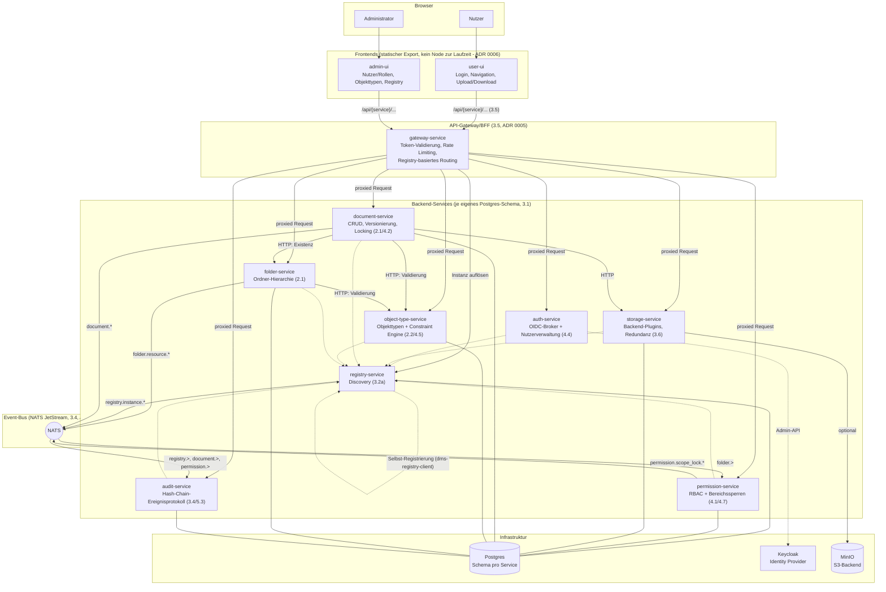

# Architektur-Überblick (Stand: MVP-Meilenstein, P4-S3)

Momentaufnahme des Systems am Ende von Phase 4 (vertikaler MVP-Slice, Konzept-Referenzen in Klammern). Für die Entstehungsgeschichte einzelner Entscheidungen siehe `docs/adr/`, für Details je Baustein `docs/services/<name>.md`.

## Gesamtbild

## Lesehinweise

- **Gestrichelte Pfeile** zur Registry: Selbst-Registrierung (Heartbeat), nicht Teil des eigentlichen Request-Pfads. Seit P4-S3 registriert sich auch der Registry Service bei sich selbst (siehe `docs/services/registry-service.md`), sonst wäre er über das Gateway nicht als `service_type=registry-service` auflösbar.
- **Gateway ist der einzige vorgesehene öffentliche Einstiegspunkt** für beide Frontends — Backend-Service-Ports sind in der Docker-Compose-Umgebung trotzdem noch direkt veröffentlicht (Entwickler-Komfort, dokumentierter offener Punkt, siehe ADR 0005).
- **Auth-Validierung** passiert zentral im Gateway (JWT gegen Keycloaks JWKS); kein Backend-Service prüft Tokens selbst nach. **Autorisierung** (wer darf was) ist dagegen an mehreren Stellen noch nicht durchgesetzt (Force-Unlock, Bereichssperren, Admin-UI-Nutzerverwaltung) — siehe die jeweiligen "Offene Punkte" in `docs/services/*.md` und die konsolidierte Liste in `PROGRESS.md`.
- **Event-Bus-Rollen**: Folder Service und Registry Service sind reine Producer ihrer eigenen Strukturereignisse; Permission Service konsumiert `folder.>` und produziert zusätzlich eigene `permission.scope_lock.*`-Events; Audit Service ist reiner Konsument/Senke für `registry.>`, `document.>`, `permission.>` (siehe ADR 0001 für die Producer/Konsument-Unterscheidung im Event-Bus-Client).
- **Nicht abgebildet**: die 30 weiteren, noch nicht gebauten Services aus `IMPLEMENTATION_PLAN.md` (Workflow Engine, Search Service, Signature Service, Federation Hub, ...) — dieses Diagramm zeigt den Stand zum MVP-Meilenstein, nicht die Zielarchitektur. Es wird an künftigen Phasengrenzen aktualisiert.

## Offene Entscheidungen

Siehe `PROGRESS.md` → Abschnitt "Offene Entscheidungen" für die laufend gepflegte, nach Themen sortierte Liste (Autorisierung, Storage, Registry/Gateway, Tooling/Testing, Frontend).
