# Architecture overview (as of: P6-S9 — Federation Hub scaffolding)

Snapshot of the system at the MVP milestone (end of Phase 4, vertical MVP slice) plus all four building blocks from Phase 5 (processing: scan, rendering, OCR, search — concept references in parentheses), the six retrofit sessions from Phase 5b (object hierarchy/class icons, form layouts, admin/user UI consumption, OCR configurability, storage device identity), the two consolidation sessions from Phase 5c (test DB isolation, storage rebalancing + device-change correction), the two sessions from Phase 5d (content-type governance: server-side sniffing + format whitelist + OCR allowlist; upload/preview UX: modal dialog with drag & drop + client-side direct text display), the three sessions from Phase 5e (license-plate generator: format string/counter on the Object Type Service, assignment + first real role check on the Document Service, display in both frontends), **P6-S1 (new `workflow-service` node, Concept 7.1)**, **P6-S2 (new `notification-service` node + timer/boundary events in workflow-service, Concept 7.1, ADR 0020)**, **P6-S3 (new `case-service` node for routing folders + editing-copy extension on the Document Service, Concept 2.3)**, **P6-S4 (generic four-eyes approval mechanism in the Permission Service + retrofit of force-unlock/scope locks, Concept 4.3, ADR 0022)** **P6-S5 (superuser break-glass + domain-separated admin roles in the Permission Service, first NATS consumer/producer for the Auth Service, retrofit of its `/users` endpoints + admin UI gating, Concept 4.6, ADR 0023)** **P6-S6 (emergency shutdown: system-wide maintenance mode, gateway as the enforcement point + header broadcast, first cross-service call from the Permission Service to the Auth Service, Concept 4.8, ADR 0024 — plus retrofit: `admin.object_config` gating of workflow-service process definitions including a second technical account `config-admin`, recipient existence check on the Notification Service)** **P6-S7 (new `signature-service` node: electronic signature SES/AES via interchangeable signature provider connectors + self-signed internal CA + pyHanko/PAdES, Signature Task in the Workflow Service via a Camunda parser switch, minimum signature level per object type, Concept 3.10, ADR 0025)** **P6-S8 (new `process-designer` frontend node: standalone, single-installation BPMN 2.0 modeling UI via `bpmn-js` [without `bpmn-js-spiffworkflow`, ADR 0026] + its own Signature Task properties panel provider against the Workflow Service from P6-S1, plus real process definition versioning in the Workflow Service [`name` as the family key, ADR 0027], Concept 7.1/8)** and **P6-S9 (new `federation-hub-service` node, deliberately standing outside any single installation: address book + control center for cross-installation workflow handover, end-to-end encryption between installations + hub-signed deliveries instead of shared secrets [ADR 0028], two new manual-task special forms `federated`/`federated_return` in the Workflow Service, new properties panel group in the Process Designer, new notification consumer in the Notification Service, Concept 7.4 — pulled forward from P13-S3/S4)**. For the history behind individual decisions see `docs/adr/`, for details per building block see `docs/services/<name>.md`.

## Overall picture

```mermaid
flowchart TB
    subgraph Clients["Browser"]
        UserBrowser["User"]
        AdminBrowser["Administrator"]
        DesignerBrowser["Process Designer User"]
    end

    subgraph Frontends["Frontends (static export, no Node at runtime - ADR 0006)"]
        UserUI["user-ui\nLogin, Navigation, Upload/Download"]
        AdminUI["admin-ui\nUsers/Roles, Object Types, Registry"]
        ProcessDesigner["process-designer\nBPMN modeling via bpmn-js,\nSignature Task Properties Panel (7.1/8, P6-S8)"]
    end

    UserBrowser --> UserUI
    AdminBrowser --> AdminUI
    DesignerBrowser --> ProcessDesigner

    UserUI -->|"/api/{service}/... (3.5)"| Gateway
    AdminUI -->|"/api/{service}/..."| Gateway
    ProcessDesigner -->|"/api/{service}/..."| Gateway

    subgraph Edge["API gateway/BFF (3.5, ADR 0005)"]
        Gateway["gateway-service\nToken validation, rate limiting,\nRegistry-based routing"]
    end

    Gateway -->|"Resolve instance"| Registry
    Gateway -->|"proxied Request"| Auth
    Gateway -->|"proxied Request"| Permission
    Gateway -->|"proxied Request"| Storage
    Gateway -->|"proxied Request"| Document
    Gateway -->|"proxied Request"| ObjectType
    Gateway -->|"proxied Request"| Folder
    Gateway -->|"proxied Request"| Audit
    Gateway -->|"proxied Request"| VirusScan
    Gateway -->|"proxied Request"| Rendering
    Gateway -->|"proxied Request"| Ocr
    Gateway -->|"proxied Request"| Search
    Gateway -->|"proxied Request"| Workflow
    Gateway -->|"proxied Request"| Notification
    Gateway -->|"proxied Request"| Case
    Gateway -->|"proxied Request"| Signature

    subgraph Backend["Backend services (each with its own Postgres schema, 3.1)"]
        Registry["registry-service\nDiscovery (3.2a)"]
        Auth["auth-service\nOIDC broker + user management (4.4)"]
        Permission["permission-service\nRBAC + scope locks (4.1/4.7)"]
        Storage["storage-service\nBackend plugins, redundancy, storage device identity, rebalancing (3.6)"]
        Document["document-service\nCRUD, versioning, locking (2.1/4.2)"]
        ObjectType["object-type-service\nObject types + constraint engine (2.2/4.5)"]
        Folder["folder-service\nFolder hierarchy (2.1)"]
        Audit["audit-service\nHash chain event log (3.4/5.3)"]
        VirusScan["virus-scan-service\nScan before upload release (10.3)"]
        Rendering["rendering-service\nPreview + substitute renditions (3.7/2.4)"]
        Ocr["ocr-service\nWord recognition + word bounding boxes (3.9)"]
        Search["search-service\nFull-text index + faceted search, Postgres FTS (3.7, ADR 0012)"]
        Workflow["workflow-service\nBPMN import/execution, manual/automatic tasks,\nSLA time monitoring, process versioning,\nfederated process steps (7.1/7.4, ADR 0018/0019/0020/0027/0028)"]
        Notification["notification-service\nEmail/in-app/webhook (7.1)"]
        Case["case-service\nRouting folders: references, closure snapshot (2.3)"]
        Signature["signature-service\nSignature provider connectors,\ninternal CA, PAdES via pyHanko (3.10)"]
    end

    subgraph External["Outside this installation (7.4)"]
        FederationHub["federation-hub-service\nAddress book + control center,\nnot an internal service (ADR 0028)"]
    end

    Document -->|HTTP| Storage
    Document -->|"HTTP: existence"| Folder
    Document -->|"HTTP: validation"| ObjectType
    Document -->|"HTTP: scan gate (ADR 0010)"| VirusScan
    Folder -->|"HTTP: validation"| ObjectType
    Case -->|"HTTP: start instance"| Workflow
    Case -->|"HTTP: read version/deletion status"| Document
    Case -->|"HTTP: validation"| ObjectType
    Document -->|"HTTP: request approval (4.3)"| Permission
    Auth -->|"HTTP: role assignment/check (4.6)"| Permission
    Permission -->|"HTTP: superuser status (4.8)"| Auth
    Workflow -->|"HTTP: permission check (4.6/4.8)"| Permission
    Notification -->|"HTTP: recipient existence (4.8)"| Auth
    Signature -->|"HTTP: read/check in version (3.10)"| Document
    Signature -->|"HTTP: minimum level (3.10)"| ObjectType
    Signature -->|"HTTP: signer existence (3.10)"| Auth
    Workflow -->|"HTTP: Signature Task check (3.10)"| Signature
    Workflow -->|"HTTP: create handover/report result (7.4)"| FederationHub
    FederationHub -->|"HTTP (hub-signed): delivery to /api/workflow-service/federation/..."| Gateway
    VirusScan -->|"HTTP: quarantine"| Storage
    Rendering -->|"HTTP: fetch original"| Document
    Rendering -->|"HTTP: store substitute rendition"| Storage
    Rendering -->|"HTTP: fetch OCR full text"| Ocr
    Ocr -->|"HTTP: fetch original"| Document
    Ocr -->|"HTTP: store page image"| Storage
    Search -->|"HTTP: fetch metadata"| Document
    Search -->|"HTTP: folder name"| Folder
    Search -->|"HTTP: object type schema"| ObjectType
    Search -->|"HTTP: batch permission check"| Permission
    Search -->|"HTTP: full text"| Ocr
    Search -->|"HTTP: full-text fallback"| Rendering

    Registry -.->|"Self-registration (dms-registry-client)"| Registry
    Auth -.-> Registry
    Permission -.-> Registry
    Storage -.-> Registry
    Document -.-> Registry
    ObjectType -.-> Registry
    Folder -.-> Registry
    Audit -.-> Registry
    VirusScan -.-> Registry
    Rendering -.-> Registry
    Ocr -.-> Registry
    Search -.-> Registry
    Workflow -.-> Registry
    Notification -.-> Registry
    Signature -.-> Registry

    subgraph Bus["Event bus (NATS JetStream, 3.4, ADR 0001)"]
        NATS(("NATS"))
    end

    Folder -->|"folder.resource.*"| NATS
    Registry -->|"registry.instance.*"| NATS
    Document -->|"document.*"| NATS
    Permission -->|"permission.scope_lock.*, permission.approval.*"| NATS
    VirusScan -->|"virus_scan.completed"| NATS
    Rendering -->|"rendering.completed"| NATS
    Ocr -->|"ocr.completed / ocr.failed"| NATS
    Workflow -->|"workflow.instance.*, workflow.task.completed/.escalated,\nworkflow.federation.inbound_received"| NATS
    Notification -->|"notification.sent / notification.failed"| NATS
    Case -->|"case.created / .document.added/.removed / .closed"| NATS
    Auth -->|"auth.superuser.activated / .deactivated"| NATS
    Permission -->|"permission.maintenance_mode.activated / .lifted"| NATS
    Signature -->|"signature.created"| NATS
    NATS -->|"folder.>"| Permission
    NATS -->|"document.>"| Rendering
    NATS -->|"document.>"| Ocr
    NATS -->|"ocr.completed"| Rendering
    NATS -->|"document.>"| Search
    NATS -->|"ocr.>, rendering.>"| Search
    NATS -->|"workflow.task.escalated, auth.superuser.activated,\npermission.maintenance_mode.activated, workflow.federation.inbound_received"| Notification
    NATS -->|"workflow.instance.completed"| Case
    NATS -->|"permission.approval.approved (self-consumption)"| Permission
    NATS -->|"permission.approval.approved"| Document
    NATS -->|"permission.approval.approved"| Auth
    NATS -->|"registry.>, document.>, permission.>, virus_scan.>, rendering.>, ocr.>, workflow.>, notification.>, case.>, auth.>, signature.>"| Audit

    subgraph Infra["Infrastructure"]
        Postgres[("Postgres\nSchema per service")]
        Keycloak["Keycloak\nIdentity Provider"]
        MinIO[("MinIO\nS3 backend")]
        Mailpit["Mailpit\nDev SMTP test server"]
    end

    Registry --- Postgres
    Auth -.->|Admin-API| Keycloak
    Permission --- Postgres
    Storage --- Postgres
    Storage -->|optional| MinIO
    Document --- Postgres
    ObjectType --- Postgres
    Folder --- Postgres
    Audit --- Postgres
    VirusScan --- Postgres
    Rendering --- Postgres
    Ocr --- Postgres
    Search --- Postgres
    Workflow --- Postgres
    Notification --- Postgres
    Notification -->|SMTP| Mailpit
    Signature --- Postgres
```

## Reading notes

- **Dashed arrows** to the Registry: self-registration (heartbeat), not part of the actual request path. Since P4-S3, the Registry Service also registers itself with itself (see `docs/services/registry-service.md`) — otherwise it would not be resolvable via the gateway as `service_type=registry-service`.
- **The gateway is the only intended public entry point** for both frontends — backend service ports are nevertheless still published directly in the Docker Compose environment (developer convenience, a documented Open Point, see ADR 0005).
- **Auth validation** happens centrally in the gateway (JWT against Keycloak's JWKS); no backend service re-checks tokens itself. **Authorization** (who is allowed to do what) is still not enforced in several places (force-unlock/scope locks remain optional rather than mandatory, the Case Service is ungated, workflow-service instance start/task completion is deliberately open to any authenticated principal) — admin UI user management has been the first enforced exception since **P6-S5** (capability `admin.user_management`, 4.6); **since P6-S6** additionally workflow-service process definitions (capability `admin.object_config`) and the notification-service recipient existence check — see the respective "Open Points" in `docs/services/*.md` and the consolidated list in `PROGRESS.md`. **Since P6-S6, additionally a system-wide maintenance mode (4.8)**: independent of RBAC, the gateway blocks every proxied request during an active emergency lock except for a small allow list, see [ADR 0024](adr/0024-not-shutdown-gateway-enforced.md).
- **Event bus roles**: the Folder Service and Registry Service are pure producers of their own structural events; the Permission Service consumes `folder.>` as well as (since P6-S4) its own `permission.approval.approved` (self-consumption for scope locks, see ADR 0022) and produces its own `permission.scope_lock.*`/`permission.approval.*` events; the Virus Scan Service is a pure producer (`virus_scan.completed`) and does not itself consume any events (the Document Service instead calls it synchronously, ADR 0010); the Rendering Service consumes both `document.>` (only `document.created`/`document.version.created` trigger anything) and, since P5-S3, `ocr.completed`, and produces its own `rendering.completed` events; the OCR Service consumes `document.>` (the same pattern as the Rendering Service) and produces its own `ocr.completed`/`ocr.failed` events; **the Search Service consumes `document.>` as well as `ocr.>`/`rendering.>`, but produces no events of its own** (a pure consumer + query API, the same role as the Audit Service); **the Workflow Service remains a pure producer** (since P6-S1: `workflow.instance.started`/`.completed`, `workflow.task.completed`; since P6-S2 additionally `workflow.task.escalated`, triggered by the SLA poll loop, ADR 0020) and does not itself consume any events; **the Notification Service has been both a consumer (`workflow.task.escalated`) and a producer (`notification.sent`/`.failed`) since P6-S2** — the first service in this project with both roles at once (two separate `NatsEventBusClient` instances, see `docs/services/notification-service.md`); **the Case Service has also been both a consumer (`workflow.instance.completed`, triggering a routing folder's closure snapshot) and a producer (`case.created`/`.document.added`/`.removed`/`.closed`) since P6-S3** — case-service is thereby the first-ever consumer of a workflow-service event (workflow-service was previously a pure producer, see above); **the Document Service has also been a consumer since P6-S4 (`permission.approval.approved`, relevant only for `action_type="document.force_unlock"`) in addition to its previously pure-producer role** — its first-ever consumer, a second `NatsEventBusClient` with `ensure_stream=False` analogous to `case-service`/`notification-service`; **the Auth Service has, for the first time ever since P6-S5, been both a consumer (`permission.approval.approved`, relevant only for `action_type="auth.superuser.activate"`) and a producer (`auth.superuser.activated`/`.deactivated`, its own `auth` stream)** — until then it had no event bus connection at all; **the Notification Service has additionally consumed `auth.superuser.activated` since P6-S5** (a second branch of the same consumer handler, dispatched by `event_type`), **additionally `permission.maintenance_mode.activated` since P6-S6** (a third branch, the same dispatch principle, a security notification on emergency-shutdown activation, 4.8), **and additionally `workflow.federation.inbound_received` since P6-S9** (a fourth branch, notifying the target installation of an incoming federated handover, 7.4); **`federation-hub-service` itself deliberately has no event bus connection** (it is not an internal service of this installation, see the P6-S9 paragraph above) — the only installation that learns of a federated handover is the one actually involved, not the hub; **the Permission Service has additionally been a caller of the Auth Service via HTTP since P6-S6** (`GET /superuser/status` when lifting maintenance mode, the first cross-service call by this service in this direction — the Auth Service has already been calling the Permission Service since P6-S5, see [ADR 0024](adr/0024-not-shutdown-gateway-enforced.md)); **the Signature Service has been a pure producer since P6-S7** (`signature.created`, its own `signature` stream) and does not itself consume any events — the same role the Workflow Service had before P6-S2; the Audit Service is a pure consumer/sink for `registry.>`, `document.>`, `permission.>`, `virus_scan.>`, `rendering.>`, `ocr.>`, `workflow.>`, `notification.>`, `case.>`, `auth.>`, `signature.>` (see ADR 0001 for the producer/consumer distinction in the event bus client).
- **The Virus Scan Service attaches synchronously, not via events** (since P5-S1, ADR 0010): the Document Service calls `/scan` directly before persisting an upload's content/metadata — necessary because 10.3 requires a scan *before* release, whereas a purely event-driven scan would only react after the content was already retrievable.
- **The Rendering Service, OCR Service, and Search Service attach asynchronously via events** (since P5-S2/P5-S3/P5-S4): unlike the virus scan, none of them needs to finish before an upload is released — all three arise as consumers of `document.created`/`document.version.created`, after the Document Service has already responded. The Document Service itself did not need to change for this (see `docs/services/document-service.md`).
- **The OCR Service feeds both rendering-service and search-service via a downstream effect** (P5-S3/P5-S4): rendering-service consumes `ocr.completed` and generates a `substitute_text` rendition from it for documents it could not itself serve for lack of OCR; search-service consumes `ocr.completed`/`rendering.completed` to re-index its full-text index once OCR/rendering have completed (occurring after the initial upload event, timing-wise). Both are cases where one processing service consumes another processing service both via events and via HTTP (full-text lookup).
- **The Search Service is the first consumer of the `X-DMS-Principal` header injected by the gateway** (P5-S4): until now, no backend service read this header, even though it is sent along with every authenticated proxied request. `GET /search` reads it for permission filtering — a search result is checked via the `folder_id` of its document (`POST /check/batch` on the Permission Service, new in this session), **not** via the `document_id` itself: documents are not permission resources of their own; only folders are tracked as `ResourceNode` (`structure_subjects = ["folder.>"]`).
- **Phase 5b (P5b-S1–S6) was purely a deepening, not a new node**: object hierarchy/class icons (ADR 0013), form layouts (ADR 0014), and their admin/user UI consumption affect object-type-service + both frontends; OCR configurability (ADR 0016) affects ocr-service + admin UI; storage device identity + multiple devices (ADR 0017) affects storage-service + admin UI. All six sessions extend nodes already present in the diagram, with no new edges in the event-bus sense (none of the retrofits publish a new, cross-service-relevant event other than `ocr.skipped`, which has the same consumer set as `ocr.completed`/`ocr.failed`).
- **Phase 5c (P5c-S1/S2) was a round of consolidating Open Points, likewise no new node**: P5c-S1 (test DB isolation) affects only test infrastructure, no production code; P5c-S2 (rebalancing to a new target, device-change correction without restart) extends storage-service + admin UI with the same ADR-0017 building blocks (retry queue, `reset_copies_for_backend`), no new edge.
- **Phase 5d (P5d-S1/S2) was again real-world user feedback, likewise no new node**: P5d-S1 (content-type sniffing + format whitelist on the Document Service, content-type allowlist on the OCR Service) extends both services + admin UI with the same single-line configuration axis as `OcrConfig`/`GuardConfig`; P5d-S2 (upload modal with drag & drop, client-side direct text display) affects only the user UI. No new edge in the event-bus sense — the Document Service continues to publish the same events, only the server-determined `content_type` value within them is now more reliable.
- **Phase 5e (P5e-S1–S3) was likewise not a new node**: the license-plate generator (format string/atomic year counter) extends object-type-service; the actual assignment + first real `X-DMS-Roles` role check across the whole system extends document-service (new realm role `dms-admin`, created by auth-service); the display extends both frontends. No new edge in the event-bus sense — none of the three sessions introduces a new event.
- **P6-S1 was the first new node since search-service (P5-S4)**: `workflow-service` (Concept 7.1) imports/executes BPMN 2.0 processes via SpiffWorkflow (ADR 0018: LGPLv3 accepted as an unmodified dependency; ADR 0019: full serialized execution state per instance instead of a dedicated task table). No dependency on any other backend service — deliberately standalone, since this session is meant to anticipate neither RBAC/approval (P6-S4–S6, see the roadmap forward-planning in `PROGRESS.md`) nor a connection to concrete business objects such as documents (`business_key` is an opaque, unvalidated reference). No UI component (the Process Designer follows only with P6-S8).
- **P6-S2 adds `notification-service` and extends `workflow-service` with timer/boundary events** (Concept 7.1, ADR 0020: polling instead of push for SLA time monitoring, no distributed lock across multiple replicas). `notification-service` is deliberately the first service with both event bus roles at once (see "Event bus roles" above) and the first with a new infra dependency (`mailpit`, a dev SMTP test server, no real sending). Recipient resolution is deliberately without RBAC (opaque `escalation_email` process datum, the same pattern as `business_key`) — real role resolution follows at the earliest with the P6-S4–S6 family.
- **P6-S3 adds `case-service` and extends `document-service` with editing copies** (Concept 2.3). Routing folders only reference documents (`HTTP: read version/deletion status` against document-service, no content of their own), start their lifecycle via a workflow-service process instance (`business_key = case_id`), and are completed (closure snapshot) upon reaching the BPMN end state via the newly consumed `workflow.instance.completed` event. Editing copies (also 2.3) deliberately got no node of their own — three additional, opaque provenance fields on document-service's existing `POST /documents`, no new endpoint (see `docs/services/document-service.md`).
- **P6-S4 adds no new node**, but a generic four-eyes approval mechanism in the Permission Service (Concept 4.3, [ADR 0022](adr/0022-four-eyes-approval-via-events.md)) plus a retrofit of two already-existing, previously ungated endpoints (Document Service force-unlock, Permission Service scope locks). Approved actions are not executed synchronously but via the new `permission.approval.approved` event — the Permission Service consumes this event itself for its own action types (scope locks); the Document Service thereby gets its first-ever consumer. By default, both remain ungated until an action type is explicitly activated via `PUT /approval-config/{action_type}`.
- **P6-S5 likewise adds no new node** (Concept 4.6, [ADR 0023](adr/0023-superuser-breakglass-and-domain-admin-accounts.md)): the Permission Service gets 8 system-owned domain-admin `Role` rows, kept separate from Keycloak realm roles (only `domain-admin-users` is actually enforced this session), as well as a generic extension of the P6-S4 mechanism (`ApprovalActionConfig.required_permission` — both the initiator *and* the approver must hold a specific capability, not just "any second person"). The Auth Service gets its first-ever event bus connection (see "Event bus roles" above) and a new, disabled-by-default superuser account, whose break-glass activation runs through exactly this extended mechanism; state is stored as a Keycloak user attribute, not in a new database. The admin UI gets a new `/superuser/` page as well as, for the first time, real role gating for `/users/` (a capability from the Permission Service instead of `user.realm_roles`).
- **P6-S6 likewise adds no new node** (Concept 4.8, [ADR 0024](adr/0024-not-shutdown-gateway-enforced.md)): the Permission Service gets a system-wide maintenance-mode state (`SystemMaintenanceMode`, singleton) as well as a ninth domain-admin role (`domain-admin-emergency`, with no automatic account, like `breakglass-approver`), and for the first time calls the Auth Service (`GET /superuser/status`, to restrict lifting the mode to the active superuser). The gateway becomes the central enforcement point: it blocks proxied requests during an active lock (with an allow-list exception) and broadcasts the state to every passed-through request via a new `X-DMS-Maintenance-Active` header, instead of having every backend service poll for it itself. The Auth Service reads this header in `/login` (login is rejected except for the superuser); the Workflow Service reads it on instance start/task completion and additionally polls it itself for its SLA loop (no incoming request there). **Additional retrofit** (a user decision, narrower in scope than a broader interpretation that would have relied on missing lane-to-role resolution): the Workflow Service gates process definitions (create/delete, including script-task upload) behind `admin.object_config` (a second technical account `config-admin`, symmetric to `users-admin`); instance start/task completion remain open to any authenticated principal; the Notification Service checks recipients of `POST /notifications` against real Auth Service accounts, but deliberately remains reachable during maintenance mode (it is itself needed for security alerting) and authenticates for the check as the existing `users-admin` account.
- **P6-S7 adds `signature-service`** (Concept 3.10, [ADR 0025](adr/0025-signature-service-internal-ca-and-connector-plugin.md)): eIDAS-compliant electronic signature (SES/AES actually implemented, QES only as an unimplemented connector placeholder) via interchangeable signature provider connectors (a plugin principle like storage-service, ADR 0017) — the only one actually implemented is an internal, self-signed connector (its own root CA, PAdES-B-B via pyHanko). Signing loads/checks in document versions directly with document-service (HTTP, no event-driven path), checks the configurable minimum level with object-type-service, and signer existence with auth-service. The Workflow Service gets a new "Signature Task" (technically an ordinary manual task with Camunda `extensionElements`, which required switching the BPMN parser from `BpmnParser` to `CamundaParser`) and calls signature-service on task completion to verify the given signature. A pure producer in the event bus (`signature.created`), no consumer.
- **P6-S8 adds `process-designer`** (Concept 7.1/8, [ADR 0026](adr/0026-process-designer-bpmn-js-without-spiffworkflow-addon.md)/[ADR 0027](adr/0027-workflow-process-definition-versioning.md)): a standalone, single-installation frontend application (not part of the admin UI) for graphical BPMN 2.0 modeling via `bpmn-js` against the existing Workflow Service, with its own properties panel provider for the Signature Task (reading/writing the same `camunda:properties` extension elements that `CamundaParser` has expected since P6-S7) instead of the `bpmn-js-spiffworkflow` addon, which was deliberately not used for this. No new backend node; the only backend change is real process definition versioning in the Workflow Service (`name` becomes a process-family key instead of a globally unique identifier, a new `version` column, `GET /process-definitions` returns by default only the newest version per family). **Follow-up question at plan approval**: cross-installation external swimlanes/handover (Federation Hub, 7.4) were additionally requested by the user, but deliberately not implemented in this session — pulled forward as a new session P6-S9 (from P13-S3/S4, see `IMPLEMENTATION_PLAN.md`/`PROGRESS.md`).
- **P6-S9 adds `federation-hub-service`** (Concept 7.4, [ADR 0028](adr/0028-federation-hub-trust-and-encryption-model.md)) — deliberately shown **outside** this installation's `Backend` subgraph (its own `External` subgraph): the hub is not an internal service, has no registry self-registration and no `depends_on: gateway-service`, and is included only for the sake of local development (see `docs/services/federation-hub-service.md`). `workflow-service` registers with the hub (opt-in), initiates handovers via HTTP, and is conversely delivered to by the hub via its **own gateway** (`FederationHub -> Gateway -> Workflow`, a public route, authenticated via a hub-signed delivery instead of `X-DMS-Principal`). Two new manual-task special forms (`taskType=federated`/`federated_return`) in the Workflow Service, a new properties panel group in the Process Designer (visible only when the hub knows of at least one installation), a new notification consumer in the Notification Service (`workflow.federation.inbound_received`). End-to-end encryption of the payload lies entirely with the installations — the hub only forwards ciphertext, it does not persist it.
- **Not depicted**: the further, not-yet-built services from `IMPLEMENTATION_PLAN.md`. A real external QTSP connector for QES (3.10) likewise does not exist (no accredited provider available/testable). This diagram shows the current state, not the target architecture. It will be updated at future phase boundaries.

## Open decisions

See `PROGRESS.md` → section "Open Decisions" for the continuously maintained, topic-sorted list (authorization, storage, registry/gateway, tooling/testing, frontend).
