# Architektur-Überblick (Stand: P5b-S6 — Phase 5b abgeschlossen)

Momentaufnahme des Systems zum MVP-Meilenstein (Ende Phase 4, vertikaler MVP-Slice) plus allen vier Bausteinen aus Phase 5 (Verarbeitung: Scan, Rendering, OCR, Suche — Konzept-Referenzen in Klammern) sowie den sechs Retrofit-Sessions aus Phase 5b (Objekt-Hierarchie/Klassen-Icons, Formular-Layouts, Admin-/User-UI-Konsum, OCR-Konfigurierbarkeit, Storage-Datenträger-Identität). Kein neuer Service ist durch Phase 5b entstanden — alle Änderungen erweitern bereits bestehende Services/Frontends. Für die Entstehungsgeschichte einzelner Entscheidungen siehe `docs/adr/`, für Details je Baustein `docs/services/<name>.md`.

## Gesamtbild

```mermaid
flowchart TB
    subgraph Clients["Browser"]
        UserBrowser["Nutzer"]
        AdminBrowser["Administrator"]
    end

    subgraph Frontends["Frontends (statischer Export, kein Node zur Laufzeit - ADR 0006)"]
        UserUI["user-ui\nLogin, Navigation, Upload/Download"]
        AdminUI["admin-ui\nNutzer/Rollen, Objekttypen, Registry"]
    end

    UserBrowser --> UserUI
    AdminBrowser --> AdminUI

    UserUI -->|"/api/{service}/... (3.5)"| Gateway
    AdminUI -->|"/api/{service}/..."| Gateway

    subgraph Edge["API-Gateway/BFF (3.5, ADR 0005)"]
        Gateway["gateway-service\nToken-Validierung, Rate Limiting,\nRegistry-basiertes Routing"]
    end

    Gateway -->|"Instanz auflösen"| Registry
    Gateway -->|"proxied Request"| Auth
    Gateway -->|"proxied Request"| Permission
    Gateway -->|"proxied Request"| Storage
    Gateway -->|"proxied Request"| Document
    Gateway -->|"proxied Request"| ObjectType
    Gateway -->|"proxied Request"| Folder
    Gateway -->|"proxied Request"| Audit
    Gateway -->|"proxied Request"| VirusScan
    Gateway -->|"proxied Request"| Rendering
    Gateway -->|"proxied Request"| Ocr
    Gateway -->|"proxied Request"| Search

    subgraph Backend["Backend-Services (je eigenes Postgres-Schema, 3.1)"]
        Registry["registry-service\nDiscovery (3.2a)"]
        Auth["auth-service\nOIDC-Broker + Nutzerverwaltung (4.4)"]
        Permission["permission-service\nRBAC + Bereichssperren (4.1/4.7)"]
        Storage["storage-service\nBackend-Plugins, Redundanz, Datenträger-Identität (3.6)"]
        Document["document-service\nCRUD, Versionierung, Locking (2.1/4.2)"]
        ObjectType["object-type-service\nObjekttypen + Constraint Engine (2.2/4.5)"]
        Folder["folder-service\nOrdner-Hierarchie (2.1)"]
        Audit["audit-service\nHash-Chain-Ereignisprotokoll (3.4/5.3)"]
        VirusScan["virus-scan-service\nScan vor Upload-Freigabe (10.3)"]
        Rendering["rendering-service\nVorschau + Ersatzdarstellungen (3.7/2.4)"]
        Ocr["ocr-service\nWorterkennung + Wort-Bounding-Boxen (3.9)"]
        Search["search-service\nVolltextindex + Facettensuche, Postgres FTS (3.7, ADR 0012)"]
    end

    Document -->|HTTP| Storage
    Document -->|HTTP: Existenz| Folder
    Document -->|HTTP: Validierung| ObjectType
    Document -->|"HTTP: Scan-Gate (ADR 0010)"| VirusScan
    Folder -->|HTTP: Validierung| ObjectType
    VirusScan -->|"HTTP: Quarantäne"| Storage
    Rendering -->|"HTTP: Original abrufen"| Document
    Rendering -->|"HTTP: Ersatzdarstellung ablegen"| Storage
    Rendering -->|"HTTP: OCR-Volltext nachladen"| Ocr
    Ocr -->|"HTTP: Original abrufen"| Document
    Ocr -->|"HTTP: Seitenbild ablegen"| Storage
    Search -->|"HTTP: Metadaten nachladen"| Document
    Search -->|"HTTP: Ordnername"| Folder
    Search -->|"HTTP: Objekttyp-Schema"| ObjectType
    Search -->|"HTTP: Batch-Rechtecheck"| Permission
    Search -->|"HTTP: Volltext"| Ocr
    Search -->|"HTTP: Volltext-Fallback"| Rendering

    Registry -.->|"Selbst-Registrierung (dms-registry-client)"| Registry
    Auth -.-> Registry
    Permission -.-> Registry
    Storage -.-> Registry
    Document -.-> Registry
    ObjectType -.-> Registry
    Folder -.-> Registry
    Audit -.-> Registry
    VirusScan -.-> Registry
    Rendering -.-> Registry
    Ocr -.-> Registry
    Search -.-> Registry

    subgraph Bus["Event-Bus (NATS JetStream, 3.4, ADR 0001)"]
        NATS(("NATS"))
    end

    Folder -->|"folder.resource.*"| NATS
    Registry -->|"registry.instance.*"| NATS
    Document -->|"document.*"| NATS
    Permission -->|"permission.scope_lock.*"| NATS
    VirusScan -->|"virus_scan.completed"| NATS
    Rendering -->|"rendering.completed"| NATS
    Ocr -->|"ocr.completed / ocr.failed"| NATS
    NATS -->|"folder.>"| Permission
    NATS -->|"document.>"| Rendering
    NATS -->|"document.>"| Ocr
    NATS -->|"ocr.completed"| Rendering
    NATS -->|"document.>"| Search
    NATS -->|"ocr.>, rendering.>"| Search
    NATS -->|"registry.>, document.>, permission.>, virus_scan.>, rendering.>, ocr.>"| Audit

    subgraph Infra["Infrastruktur"]
        Postgres[("Postgres\nSchema pro Service")]
        Keycloak["Keycloak\nIdentity Provider"]
        MinIO[("MinIO\nS3-Backend")]
    end

    Registry --- Postgres
    Auth -.->|Admin-API| Keycloak
    Permission --- Postgres
    Storage --- Postgres
    Storage -->|optional| MinIO
    Document --- Postgres
    ObjectType --- Postgres
    Folder --- Postgres
    Audit --- Postgres
    VirusScan --- Postgres
    Rendering --- Postgres
    Ocr --- Postgres
    Search --- Postgres
```

## Lesehinweise

- **Gestrichelte Pfeile** zur Registry: Selbst-Registrierung (Heartbeat), nicht Teil des eigentlichen Request-Pfads. Seit P4-S3 registriert sich auch der Registry Service bei sich selbst (siehe `docs/services/registry-service.md`), sonst wäre er über das Gateway nicht als `service_type=registry-service` auflösbar.
- **Gateway ist der einzige vorgesehene öffentliche Einstiegspunkt** für beide Frontends — Backend-Service-Ports sind in der Docker-Compose-Umgebung trotzdem noch direkt veröffentlicht (Entwickler-Komfort, dokumentierter offener Punkt, siehe ADR 0005).
- **Auth-Validierung** passiert zentral im Gateway (JWT gegen Keycloaks JWKS); kein Backend-Service prüft Tokens selbst nach. **Autorisierung** (wer darf was) ist dagegen an mehreren Stellen noch nicht durchgesetzt (Force-Unlock, Bereichssperren, Admin-UI-Nutzerverwaltung) — siehe die jeweiligen "Offene Punkte" in `docs/services/*.md` und die konsolidierte Liste in `PROGRESS.md`.
- **Event-Bus-Rollen**: Folder Service und Registry Service sind reine Producer ihrer eigenen Strukturereignisse; Permission Service konsumiert `folder.>` und produziert zusätzlich eigene `permission.scope_lock.*`-Events; Virus-Scan Service ist reiner Producer (`virus_scan.completed`), konsumiert selbst keine Events (Document Service ruft ihn stattdessen synchron auf, ADR 0010); Rendering Service konsumiert sowohl `document.>` (nur `document.created`/`document.version.created` lösen etwas aus) als auch seit P5-S3 `ocr.completed`, und produziert eigene `rendering.completed`-Events; OCR Service konsumiert `document.>` (dasselbe Muster wie Rendering Service) und produziert eigene `ocr.completed`/`ocr.failed`-Events; **Search Service konsumiert `document.>` sowie `ocr.>`/`rendering.>`, produziert aber keine eigenen Events** (reiner Konsument + Query-API, dieselbe Rolle wie Audit Service); Audit Service ist reiner Konsument/Senke für `registry.>`, `document.>`, `permission.>`, `virus_scan.>`, `rendering.>`, `ocr.>` (siehe ADR 0001 für die Producer/Konsument-Unterscheidung im Event-Bus-Client).
- **Virus-Scan Service dockt synchron an, nicht über Events** (seit P5-S1, ADR 0010): Document Service ruft `/scan` direkt auf, bevor er Inhalt/Metadaten eines Uploads persistiert — nötig, weil 10.3 einen Scan *vor* Freigabe verlangt, ein rein event-getriebener Scan aber erst reagieren würde, nachdem der Inhalt bereits abrufbar wäre.
- **Rendering Service, OCR Service und Search Service docken asynchron über Events an** (seit P5-S2/P5-S3/P5-S4): anders als der Virenscan muss keiner von ihnen vor der Freigabe eines Uploads fertig sein — alle drei entstehen als Konsumenten von `document.created`/`document.version.created`, nachdem Document Service bereits geantwortet hat. Document Service selbst musste dafür nicht geändert werden (siehe `docs/services/document-service.md`).
- **OCR Service speist sowohl rendering-service als auch search-service per Nachzieheffekt** (P5-S3/P5-S4): rendering-service konsumiert `ocr.completed` und erzeugt daraus eine `substitute_text`-Rendition für Dokumente, die es selbst mangels OCR nicht bedienen konnte; search-service konsumiert `ocr.completed`/`rendering.completed`, um seinen Volltextindex nachzuindexieren, sobald OCR/Rendering abgeschlossen sind (zeitlich nach dem initialen Upload-Event). Beides sind Fälle, in denen ein Verarbeitungs-Service einen anderen Verarbeitungs-Service sowohl per Event als auch per HTTP (Volltext-Nachschlag) konsumiert.
- **Search Service ist der erste Konsument des vom Gateway injizierten `X-DMS-Principal`-Headers** (P5-S4): bislang liest kein Backend-Service diesen Header aus, obwohl er auf jedem authentifizierten proxied Request mitgeschickt wird. `GET /search` liest ihn für die Berechtigungsfilterung — ein Suchergebnis wird über die `folder_id` seines Dokuments geprüft (`POST /check/batch` am Permission Service, neu in dieser Session), **nicht** über die `document_id` selbst: Dokumente sind keine eigenen Permission-Resources, nur Ordner werden als `ResourceNode` geführt (`structure_subjects = ["folder.>"]`).
- **Phase 5b (P5b-S1–S6) war reine Vertiefung, kein neuer Knoten**: Objekt-Hierarchie/Klassen-Icons (ADR 0013), Formular-Layouts (ADR 0014) und ihr Admin-/User-UI-Konsum betreffen object-type-service + beide Frontends; OCR-Konfigurierbarkeit (ADR 0016) betrifft ocr-service + Admin-UI; Storage-Datenträger-Identität + Mehrfach-Devices (ADR 0017) betrifft storage-service + Admin-UI. Alle sechs Sessions erweitern bereits im Diagramm vorhandene Knoten, keine neuen Kanten im Event-Bus-Sinn (keiner der Retrofits publiziert ein neues, cross-service relevantes Event außer `ocr.skipped`, das denselben Konsumentenkreis wie `ocr.completed`/`ocr.failed` hat).
- **Nicht abgebildet**: die 26 weiteren, noch nicht gebauten Services aus `IMPLEMENTATION_PLAN.md` (Workflow Engine, Signature Service, Federation Hub, ...) — Phase 5 (Verarbeitung: Scan, Rendering, OCR, Suche) und Phase 5b (Vertiefung/Retrofit bereits bestehender Services) sind mit dieser Session vollständig abgebildet. Dieses Diagramm zeigt den aktuellen Stand, nicht die Zielarchitektur. Es wird an künftigen Phasengrenzen aktualisiert.

## Offene Entscheidungen

Siehe `PROGRESS.md` → Abschnitt "Offene Entscheidungen" für die laufend gepflegte, nach Themen sortierte Liste (Autorisierung, Storage, Registry/Gateway, Tooling/Testing, Frontend).
