# Architektur-Überblick (Stand: P6-S9 — Federation Hub Grundgerüst)

Momentaufnahme des Systems zum MVP-Meilenstein (Ende Phase 4, vertikaler MVP-Slice) plus allen vier Bausteinen aus Phase 5 (Verarbeitung: Scan, Rendering, OCR, Suche — Konzept-Referenzen in Klammern), den sechs Retrofit-Sessions aus Phase 5b (Objekt-Hierarchie/Klassen-Icons, Formular-Layouts, Admin-/User-UI-Konsum, OCR-Konfigurierbarkeit, Storage-Datenträger-Identität), den zwei Konsolidierungs-Sessions aus Phase 5c (Test-DB-Isolation, Storage-Rebalancing + Gerätewechsel-Korrektur), den zwei Sessions aus Phase 5d (Content-Type-Governance: serverseitiges Sniffing + Format-Whitelist + OCR-Positivliste; Upload-/Vorschau-UX: Modal-Dialog mit Drag & Drop + clientseitige Text-Direktanzeige), den drei Sessions aus Phase 5e (Kennzeichengenerator: Format-String/Zähler am Object-Type Service, Vergabe + erste echte Rollenprüfung am Document Service, Anzeige in beiden Frontends), **P6-S1 (neuer `workflow-service`-Knoten, Konzept 7.1)**, **P6-S2 (neuer `notification-service`-Knoten + Timer/Boundary Events in workflow-service, Konzept 7.1, ADR 0020)**, **P6-S3 (neuer `case-service`-Knoten für Umlaufmappen + Bearbeitungskopie-Erweiterung am Document Service, Konzept 2.3)**, **P6-S4 (generischer Vier-Augen-Approval-Mechanismus im Permission Service + Retrofit von Force-Unlock/Bereichssperren, Konzept 4.3, ADR 0022)** **P6-S5 (Superuser Break-Glass + domänengetrennte Admin-Rollen im Permission Service, erster NATS-Konsument/-Producer für den Auth Service, Retrofit von dessen `/users`-Endpunkten + Admin-UI-Gating, Konzept 4.6, ADR 0023)** **P6-S6 (Not-Shutdown: systemweiter Wartungsmodus, Gateway als Durchsetzungspunkt + Header-Broadcast, erster Cross-Service-Aufruf des Permission Service zum Auth Service, Konzept 4.8, ADR 0024 — plus Retrofit: `admin.object_config`-Gating der Workflow-Service-Prozessdefinitionen inkl. zweitem technischem Konto `config-admin`, Empfänger-Existenzprüfung am Notification Service)** **P6-S7 (neuer `signature-service`-Knoten: elektronische Signatur SES/AES via austauschbare Signature-Provider-Connectoren + selbstsignierte interne CA + pyHanko/PAdES, Signature Task im Workflow Service über einen Camunda-Parser-Wechsel, Mindest-Signaturniveau je Objekttyp, Konzept 3.10, ADR 0025)** **P6-S8 (neuer `process-designer`-Frontend-Knoten: eigenständige, single-installation BPMN-2.0-Modellierungs-UI via `bpmn-js` [ohne `bpmn-js-spiffworkflow`, ADR 0026] + eigenem Signature-Task-Properties-Panel-Provider gegen den Workflow Service aus P6-S1, plus echte Prozessdefinition-Versionierung im Workflow Service [`name` als Familienschlüssel, ADR 0027], Konzept 7.1/8)** und **P6-S9 (neuer, bewusst außerhalb einer einzelnen Installation stehender `federation-hub-service`-Knoten: Adressbuch + Schaltzentrale für installationsübergreifende Workflow-Handover, Ende-zu-Ende-Verschlüsselung zwischen Installationen + Hub-signierte Zustellungen statt geteilter Geheimnisse [ADR 0028], zwei neue Manual-Task-Sonderformen `federated`/`federated_return` im Workflow Service, neue Properties-Panel-Gruppe im Process Designer, neuer Benachrichtigungs-Konsument im Notification Service, Konzept 7.4 — vorgezogen von P13-S3/S4)**. Für die Entstehungsgeschichte einzelner Entscheidungen siehe `docs/adr/`, für Details je Baustein `docs/services/<name>.md`.

## Gesamtbild

```mermaid
flowchart TB
    subgraph Clients["Browser"]
        UserBrowser["Nutzer"]
        AdminBrowser["Administrator"]
        DesignerBrowser["Prozess-Designer-Nutzer"]
    end

    subgraph Frontends["Frontends (statischer Export, kein Node zur Laufzeit - ADR 0006)"]
        UserUI["user-ui\nLogin, Navigation, Upload/Download"]
        AdminUI["admin-ui\nNutzer/Rollen, Objekttypen, Registry"]
        ProcessDesigner["process-designer\nBPMN-Modellierung via bpmn-js,\nSignature Task Properties Panel (7.1/8, P6-S8)"]
    end

    UserBrowser --> UserUI
    AdminBrowser --> AdminUI
    DesignerBrowser --> ProcessDesigner

    UserUI -->|"/api/{service}/... (3.5)"| Gateway
    AdminUI -->|"/api/{service}/..."| Gateway
    ProcessDesigner -->|"/api/{service}/..."| Gateway

    subgraph Edge["API-Gateway/BFF (3.5, ADR 0005)"]
        Gateway["gateway-service\nToken-Validierung, Rate Limiting,\nRegistry-basiertes Routing"]
    end

    Gateway -->|"Instanz auflösen"| Registry
    Gateway -->|"proxied Request"| Auth
    Gateway -->|"proxied Request"| Permission
    Gateway -->|"proxied Request"| Storage
    Gateway -->|"proxied Request"| Document
    Gateway -->|"proxied Request"| ObjectType
    Gateway -->|"proxied Request"| Folder
    Gateway -->|"proxied Request"| Audit
    Gateway -->|"proxied Request"| VirusScan
    Gateway -->|"proxied Request"| Rendering
    Gateway -->|"proxied Request"| Ocr
    Gateway -->|"proxied Request"| Search
    Gateway -->|"proxied Request"| Workflow
    Gateway -->|"proxied Request"| Notification
    Gateway -->|"proxied Request"| Case
    Gateway -->|"proxied Request"| Signature

    subgraph Backend["Backend-Services (je eigenes Postgres-Schema, 3.1)"]
        Registry["registry-service\nDiscovery (3.2a)"]
        Auth["auth-service\nOIDC-Broker + Nutzerverwaltung (4.4)"]
        Permission["permission-service\nRBAC + Bereichssperren (4.1/4.7)"]
        Storage["storage-service\nBackend-Plugins, Redundanz, Datenträger-Identität, Rebalancing (3.6)"]
        Document["document-service\nCRUD, Versionierung, Locking (2.1/4.2)"]
        ObjectType["object-type-service\nObjekttypen + Constraint Engine (2.2/4.5)"]
        Folder["folder-service\nOrdner-Hierarchie (2.1)"]
        Audit["audit-service\nHash-Chain-Ereignisprotokoll (3.4/5.3)"]
        VirusScan["virus-scan-service\nScan vor Upload-Freigabe (10.3)"]
        Rendering["rendering-service\nVorschau + Ersatzdarstellungen (3.7/2.4)"]
        Ocr["ocr-service\nWorterkennung + Wort-Bounding-Boxen (3.9)"]
        Search["search-service\nVolltextindex + Facettensuche, Postgres FTS (3.7, ADR 0012)"]
        Workflow["workflow-service\nBPMN-Import/-Ausführung, Manual/Automatic Tasks,\nSLA-Zeitüberwachung, Prozess-Versionierung,\nföderierte Prozessschritte (7.1/7.4, ADR 0018/0019/0020/0027/0028)"]
        Notification["notification-service\nE-Mail/In-App/Webhook (7.1)"]
        Case["case-service\nUmlaufmappen: Referenzen, Abschluss-Snapshot (2.3)"]
        Signature["signature-service\nSignature-Provider-Connectoren,\ninterne CA, PAdES via pyHanko (3.10)"]
    end

    subgraph External["Außerhalb dieser Installation (7.4)"]
        FederationHub["federation-hub-service\nAdressbuch + Schaltzentrale,\nkein interner Service (ADR 0028)"]
    end

    Document -->|HTTP| Storage
    Document -->|HTTP: Existenz| Folder
    Document -->|HTTP: Validierung| ObjectType
    Document -->|"HTTP: Scan-Gate (ADR 0010)"| VirusScan
    Folder -->|HTTP: Validierung| ObjectType
    Case -->|"HTTP: Instanz starten"| Workflow
    Case -->|"HTTP: Version/Löschstatus lesen"| Document
    Case -->|HTTP: Validierung| ObjectType
    Document -->|"HTTP: Approval anfragen (4.3)"| Permission
    Auth -->|"HTTP: Rollenzuweisung/-Check (4.6)"| Permission
    Permission -->|"HTTP: Superuser-Status (4.8)"| Auth
    Workflow -->|"HTTP: Rechte-Check (4.6/4.8)"| Permission
    Notification -->|"HTTP: Empfänger-Existenz (4.8)"| Auth
    Signature -->|"HTTP: Version lesen/einchecken (3.10)"| Document
    Signature -->|"HTTP: Mindestniveau (3.10)"| ObjectType
    Signature -->|"HTTP: Signer-Existenz (3.10)"| Auth
    Workflow -->|"HTTP: Signature Task-Check (3.10)"| Signature
    Workflow -->|"HTTP: Handover anlegen/Ergebnis melden (7.4)"| FederationHub
    FederationHub -->|"HTTP (Hub-signiert): Zustellung an /api/workflow-service/federation/..."| Gateway
    VirusScan -->|"HTTP: Quarantäne"| Storage
    Rendering -->|"HTTP: Original abrufen"| Document
    Rendering -->|"HTTP: Ersatzdarstellung ablegen"| Storage
    Rendering -->|"HTTP: OCR-Volltext nachladen"| Ocr
    Ocr -->|"HTTP: Original abrufen"| Document
    Ocr -->|"HTTP: Seitenbild ablegen"| Storage
    Search -->|"HTTP: Metadaten nachladen"| Document
    Search -->|"HTTP: Ordnername"| Folder
    Search -->|"HTTP: Objekttyp-Schema"| ObjectType
    Search -->|"HTTP: Batch-Rechtecheck"| Permission
    Search -->|"HTTP: Volltext"| Ocr
    Search -->|"HTTP: Volltext-Fallback"| Rendering

    Registry -.->|"Selbst-Registrierung (dms-registry-client)"| Registry
    Auth -.-> Registry
    Permission -.-> Registry
    Storage -.-> Registry
    Document -.-> Registry
    ObjectType -.-> Registry
    Folder -.-> Registry
    Audit -.-> Registry
    VirusScan -.-> Registry
    Rendering -.-> Registry
    Ocr -.-> Registry
    Search -.-> Registry
    Workflow -.-> Registry
    Notification -.-> Registry
    Signature -.-> Registry

    subgraph Bus["Event-Bus (NATS JetStream, 3.4, ADR 0001)"]
        NATS(("NATS"))
    end

    Folder -->|"folder.resource.*"| NATS
    Registry -->|"registry.instance.*"| NATS
    Document -->|"document.*"| NATS
    Permission -->|"permission.scope_lock.*, permission.approval.*"| NATS
    VirusScan -->|"virus_scan.completed"| NATS
    Rendering -->|"rendering.completed"| NATS
    Ocr -->|"ocr.completed / ocr.failed"| NATS
    Workflow -->|"workflow.instance.*, workflow.task.completed/.escalated,\nworkflow.federation.inbound_received"| NATS
    Notification -->|"notification.sent / notification.failed"| NATS
    Case -->|"case.created / .document.added/.removed / .closed"| NATS
    Auth -->|"auth.superuser.activated / .deactivated"| NATS
    Permission -->|"permission.maintenance_mode.activated / .lifted"| NATS
    Signature -->|"signature.created"| NATS
    NATS -->|"folder.>"| Permission
    NATS -->|"document.>"| Rendering
    NATS -->|"document.>"| Ocr
    NATS -->|"ocr.completed"| Rendering
    NATS -->|"document.>"| Search
    NATS -->|"ocr.>, rendering.>"| Search
    NATS -->|"workflow.task.escalated, auth.superuser.activated,\npermission.maintenance_mode.activated, workflow.federation.inbound_received"| Notification
    NATS -->|"workflow.instance.completed"| Case
    NATS -->|"permission.approval.approved (Selbst-Konsum)"| Permission
    NATS -->|"permission.approval.approved"| Document
    NATS -->|"permission.approval.approved"| Auth
    NATS -->|"registry.>, document.>, permission.>, virus_scan.>, rendering.>, ocr.>, workflow.>, notification.>, case.>, auth.>, signature.>"| Audit

    subgraph Infra["Infrastruktur"]
        Postgres[("Postgres\nSchema pro Service")]
        Keycloak["Keycloak\nIdentity Provider"]
        MinIO[("MinIO\nS3-Backend")]
        Mailpit["Mailpit\nDev-SMTP-Testserver"]
    end

    Registry --- Postgres
    Auth -.->|Admin-API| Keycloak
    Permission --- Postgres
    Storage --- Postgres
    Storage -->|optional| MinIO
    Document --- Postgres
    ObjectType --- Postgres
    Folder --- Postgres
    Audit --- Postgres
    VirusScan --- Postgres
    Rendering --- Postgres
    Ocr --- Postgres
    Search --- Postgres
    Workflow --- Postgres
    Notification --- Postgres
    Notification -->|SMTP| Mailpit
    Signature --- Postgres
```

## Lesehinweise

- **Gestrichelte Pfeile** zur Registry: Selbst-Registrierung (Heartbeat), nicht Teil des eigentlichen Request-Pfads. Seit P4-S3 registriert sich auch der Registry Service bei sich selbst (siehe `docs/services/registry-service.md`), sonst wäre er über das Gateway nicht als `service_type=registry-service` auflösbar.
- **Gateway ist der einzige vorgesehene öffentliche Einstiegspunkt** für beide Frontends — Backend-Service-Ports sind in der Docker-Compose-Umgebung trotzdem noch direkt veröffentlicht (Entwickler-Komfort, dokumentierter offener Punkt, siehe ADR 0005).
- **Auth-Validierung** passiert zentral im Gateway (JWT gegen Keycloaks JWKS); kein Backend-Service prüft Tokens selbst nach. **Autorisierung** (wer darf was) ist an mehreren Stellen weiterhin nicht durchgesetzt (Force-Unlock/Bereichssperren bleiben optional statt zwingend, Case-Service ungated, Workflow-Service-Instanzstart/Task-Abschluss bewusst offen für jeden authentifizierten Principal) — Admin-UI-Nutzerverwaltung ist seit **P6-S5** die erste durchgesetzte Ausnahme (Capability `admin.user_management`, 4.6), **seit P6-S6** zusätzlich Workflow-Service-Prozessdefinitionen (Capability `admin.object_config`) und die Notification-Service-Empfänger-Existenzprüfung — siehe die jeweiligen "Offene Punkte" in `docs/services/*.md` und die konsolidierte Liste in `PROGRESS.md`. **Seit P6-S6 zusätzlich ein systemweiter Wartungsmodus (4.8)**: unabhängig von RBAC blockiert das Gateway während einer aktiven Notfallsperre jeden proxied Request außer einer kleinen Allow-Liste, siehe [ADR 0024](adr/0024-not-shutdown-gateway-enforced.md).
- **Event-Bus-Rollen**: Folder Service und Registry Service sind reine Producer ihrer eigenen Strukturereignisse; Permission Service konsumiert `folder.>` sowie (seit P6-S4) sein eigenes `permission.approval.approved` (Selbst-Konsum für Bereichssperren, siehe ADR 0022) und produziert eigene `permission.scope_lock.*`-/`permission.approval.*`-Events; Virus-Scan Service ist reiner Producer (`virus_scan.completed`), konsumiert selbst keine Events (Document Service ruft ihn stattdessen synchron auf, ADR 0010); Rendering Service konsumiert sowohl `document.>` (nur `document.created`/`document.version.created` lösen etwas aus) als auch seit P5-S3 `ocr.completed`, und produziert eigene `rendering.completed`-Events; OCR Service konsumiert `document.>` (dasselbe Muster wie Rendering Service) und produziert eigene `ocr.completed`/`ocr.failed`-Events; **Search Service konsumiert `document.>` sowie `ocr.>`/`rendering.>`, produziert aber keine eigenen Events** (reiner Konsument + Query-API, dieselbe Rolle wie Audit Service); **Workflow Service ist weiterhin reiner Producer** (seit P6-S1: `workflow.instance.started`/`.completed`, `workflow.task.completed`; seit P6-S2 zusätzlich `workflow.task.escalated`, ausgelöst vom SLA-Poll-Loop, ADR 0020) und konsumiert selbst keine Events; **Notification Service ist seit P6-S2 sowohl Konsument (`workflow.task.escalated`) als auch Producer (`notification.sent`/`.failed`)** — der erste Service in diesem Projekt, der beide Rollen gleichzeitig hat (zwei getrennte `NatsEventBusClient`-Instanzen, siehe `docs/services/notification-service.md`); **Case Service ist seit P6-S3 ebenfalls sowohl Konsument (`workflow.instance.completed`, löst den Abschluss-Snapshot einer Umlaufmappe aus) als auch Producer (`case.created`/`.document.added`/`.removed`/`.closed`)** — case-service ist damit der erste Konsument eines workflow-service-Events überhaupt (workflow-service war zuvor reiner Producer, siehe oben); **Document Service ist seit P6-S4 ebenfalls Konsument (`permission.approval.approved`, nur für `action_type="document.force_unlock"` relevant) zusätzlich zu seiner bisherigen reinen Producer-Rolle** — sein erster Konsument überhaupt, zweiter `NatsEventBusClient` mit `ensure_stream=False` analog zu `case-service`/`notification-service`; **Auth Service ist seit P6-S5 zum ersten Mal überhaupt sowohl Konsument (`permission.approval.approved`, nur für `action_type="auth.superuser.activate"` relevant) als auch Producer (`auth.superuser.activated`/`.deactivated`, eigener Stream `auth`)** — bis dahin komplett event-bus-los; **Notification Service konsumiert seit P6-S5 zusätzlich `auth.superuser.activated`** (zweiter Zweig desselben Consumer-Handlers, dispatcht nach `event_type`), **seit P6-S6 zusätzlich `permission.maintenance_mode.activated`** (dritter Zweig, gleiches Dispatch-Prinzip, Sicherheitsbenachrichtigung bei Not-Shutdown-Auslösung, 4.8), **seit P6-S9 zusätzlich `workflow.federation.inbound_received`** (vierter Zweig, Benachrichtigung der Zielinstallation bei einer eingehenden föderierten Übergabe, 7.4); **`federation-hub-service` selbst hat bewusst keine Event-Bus-Anbindung** (kein interner Service dieser Installation, siehe P6-S9-Absatz oben) — die einzige Installation, die von einer föderierten Übergabe erfährt, ist die tatsächlich beteiligte, nicht der Hub; **Permission Service ist seit P6-S6 zusätzlich Aufrufer des Auth Service per HTTP** (`GET /superuser/status` beim Aufheben des Wartungsmodus, erster Cross-Service-Aufruf dieses Service in dieser Richtung — Auth Service ruft Permission Service bereits seit P6-S5 auf, siehe [ADR 0024](adr/0024-not-shutdown-gateway-enforced.md)); **Signature Service ist seit P6-S7 reiner Producer** (`signature.created`, eigener Stream `signature`) und konsumiert selbst keine Events — dieselbe Rolle wie Workflow Service vor P6-S2; Audit Service ist reiner Konsument/Senke für `registry.>`, `document.>`, `permission.>`, `virus_scan.>`, `rendering.>`, `ocr.>`, `workflow.>`, `notification.>`, `case.>`, `auth.>`, `signature.>` (siehe ADR 0001 für die Producer/Konsument-Unterscheidung im Event-Bus-Client).
- **Virus-Scan Service dockt synchron an, nicht über Events** (seit P5-S1, ADR 0010): Document Service ruft `/scan` direkt auf, bevor er Inhalt/Metadaten eines Uploads persistiert — nötig, weil 10.3 einen Scan *vor* Freigabe verlangt, ein rein event-getriebener Scan aber erst reagieren würde, nachdem der Inhalt bereits abrufbar wäre.
- **Rendering Service, OCR Service und Search Service docken asynchron über Events an** (seit P5-S2/P5-S3/P5-S4): anders als der Virenscan muss keiner von ihnen vor der Freigabe eines Uploads fertig sein — alle drei entstehen als Konsumenten von `document.created`/`document.version.created`, nachdem Document Service bereits geantwortet hat. Document Service selbst musste dafür nicht geändert werden (siehe `docs/services/document-service.md`).
- **OCR Service speist sowohl rendering-service als auch search-service per Nachzieheffekt** (P5-S3/P5-S4): rendering-service konsumiert `ocr.completed` und erzeugt daraus eine `substitute_text`-Rendition für Dokumente, die es selbst mangels OCR nicht bedienen konnte; search-service konsumiert `ocr.completed`/`rendering.completed`, um seinen Volltextindex nachzuindexieren, sobald OCR/Rendering abgeschlossen sind (zeitlich nach dem initialen Upload-Event). Beides sind Fälle, in denen ein Verarbeitungs-Service einen anderen Verarbeitungs-Service sowohl per Event als auch per HTTP (Volltext-Nachschlag) konsumiert.
- **Search Service ist der erste Konsument des vom Gateway injizierten `X-DMS-Principal`-Headers** (P5-S4): bislang liest kein Backend-Service diesen Header aus, obwohl er auf jedem authentifizierten proxied Request mitgeschickt wird. `GET /search` liest ihn für die Berechtigungsfilterung — ein Suchergebnis wird über die `folder_id` seines Dokuments geprüft (`POST /check/batch` am Permission Service, neu in dieser Session), **nicht** über die `document_id` selbst: Dokumente sind keine eigenen Permission-Resources, nur Ordner werden als `ResourceNode` geführt (`structure_subjects = ["folder.>"]`).
- **Phase 5b (P5b-S1–S6) war reine Vertiefung, kein neuer Knoten**: Objekt-Hierarchie/Klassen-Icons (ADR 0013), Formular-Layouts (ADR 0014) und ihr Admin-/User-UI-Konsum betreffen object-type-service + beide Frontends; OCR-Konfigurierbarkeit (ADR 0016) betrifft ocr-service + Admin-UI; Storage-Datenträger-Identität + Mehrfach-Devices (ADR 0017) betrifft storage-service + Admin-UI. Alle sechs Sessions erweitern bereits im Diagramm vorhandene Knoten, keine neuen Kanten im Event-Bus-Sinn (keiner der Retrofits publiziert ein neues, cross-service relevantes Event außer `ocr.skipped`, das denselben Konsumentenkreis wie `ocr.completed`/`ocr.failed` hat).
- **Phase 5c (P5c-S1/S2) war eine Konsolidierungsrunde offener Punkte, ebenfalls kein neuer Knoten**: P5c-S1 (Test-DB-Isolation) betrifft nur Test-Infrastruktur, keinen Produktionscode; P5c-S2 (Rebalancing bei neuem Ziel, Gerätewechsel-Korrektur ohne Neustart) erweitert storage-service + Admin-UI um dieselben ADR-0017-Bausteine (Retry-Queue, `reset_copies_for_backend`), keine neue Kante.
- **Phase 5d (P5d-S1/S2) war erneutes Nutzer-Feedback aus tatsächlicher Nutzung, ebenfalls kein neuer Knoten**: P5d-S1 (Content-Type-Sniffing + Format-Whitelist am Document Service, Content-Type-Positivliste am OCR Service) erweitert beide Services + Admin-UI um dieselbe Einzelzeilen-Konfigurationsachse wie `OcrConfig`/`GuardConfig`; P5d-S2 (Upload-Modal mit Drag & Drop, clientseitige Text-Direktanzeige) betrifft ausschließlich die User-UI. Keine neue Kante im Event-Bus-Sinn — der Document Service publiziert weiterhin dieselben Events, nur der serverseitig ermittelte `content_type`-Wert darin ist jetzt zuverlässiger.
- **Phase 5e (P5e-S1–S3) war ebenfalls kein neuer Knoten**: Kennzeichengenerator (Format-String/atomarer Jahres-Zähler) erweitert object-type-service, die tatsächliche Vergabe + erste echte `X-DMS-Roles`-Rollenprüfung im gesamten System erweitert document-service (neue Realm-Rolle `dms-admin`, angelegt von auth-service), die Anzeige erweitert beide Frontends. Keine neue Kante im Event-Bus-Sinn — keiner der drei Sessions führt ein neues Event ein.
- **P6-S1 war der erste neue Knoten seit search-service (P5-S4)**: `workflow-service` (Konzept 7.1) importiert/führt BPMN-2.0-Prozesse über SpiffWorkflow aus (ADR 0018: LGPLv3 als unveränderte Dependency akzeptiert; ADR 0019: voller serialisierter Ausführungszustand je Instanz statt eigener Task-Tabelle). Ohne Abhängigkeit zu einem anderen Backend-Service — bewusst eigenständig, da diese Session weder RBAC/Approval (P6-S4–S6, siehe Roadmap-Vorausplanung in `PROGRESS.md`) noch eine Anbindung an konkrete Geschäftsobjekte wie Dokumente vorwegnehmen soll (`business_key` ist eine opake, unvalidierte Referenz). Kein UI-Anteil (Process-Designer folgt erst mit P6-S8).
- **P6-S2 fügt `notification-service` hinzu und erweitert `workflow-service` um Timer/Boundary Events** (Konzept 7.1, ADR 0020: Polling statt Push für die SLA-Zeitüberwachung, keine verteilte Sperre bei mehreren Replikaten). `notification-service` ist bewusst der erste Service mit beiden Event-Bus-Rollen gleichzeitig (siehe "Event-Bus-Rollen" oben) und der erste mit einer neuen Infra-Abhängigkeit (`mailpit`, Dev-SMTP-Testserver, kein echter Versand). Empfänger-Auflösung bewusst ohne RBAC (opakes `escalation_email`-Prozessdatum, gleiches Muster wie `business_key`) — echte Rollen-Auflösung folgt frühestens mit der P6-S4–S6-Familie.
- **P6-S3 fügt `case-service` hinzu und erweitert `document-service` um Bearbeitungskopien** (Konzept 2.3). Umlaufmappen referenzieren Dokumente nur (`HTTP: Version/Löschstatus lesen` gegen document-service, kein eigener Inhalt), starten ihren Lebenszyklus über eine workflow-service-Prozessinstanz (`business_key = case_id`) und werden beim Erreichen des BPMN-Endzustands über das neu konsumierte `workflow.instance.completed`-Event abgeschlossen (Abschluss-Snapshot). Bearbeitungskopien (ebenfalls 2.3) bekamen bewusst keinen eigenen Knoten — drei zusätzliche, opake Herkunftsfelder an `document-service`s bestehendem `POST /documents`, kein neuer Endpunkt (siehe `docs/services/document-service.md`).
- **P6-S4 fügt keinen neuen Knoten hinzu**, sondern einen generischen Vier-Augen-Approval-Mechanismus im Permission Service (Konzept 4.3, [ADR 0022](adr/0022-four-eyes-approval-via-events.md)) plus Retrofit von zwei bereits bestehenden, bislang ungegateten Endpunkten (Document-Service-Force-Unlock, Permission-Service-Bereichssperren). Genehmigte Aktionen werden nicht synchron ausgeführt, sondern über das neue `permission.approval.approved`-Event — Permission Service konsumiert dieses Event für seine eigenen Aktionstypen selbst (Bereichssperren), Document Service bekommt dafür seinen ersten Konsumenten überhaupt. Per Default bleibt beides ungated, bis ein Aktionstyp explizit über `PUT /approval-config/{action_type}` aktiviert wird.
- **P6-S5 fügt ebenfalls keinen neuen Knoten hinzu** (Konzept 4.6, [ADR 0023](adr/0023-superuser-breakglass-and-domain-admin-accounts.md)): Permission Service bekommt 8 systemeigene, von Keycloak-Realm-Rollen getrennte Domain-Admin-`Role`-Zeilen (nur `domain-admin-users` diese Session tatsächlich durchgesetzt) sowie eine generische Erweiterung des P6-S4-Mechanismus (`ApprovalActionConfig.required_permission` — Initiator *und* Genehmiger müssen eine bestimmte Capability halten, nicht nur "irgendeine zweite Person"). Auth Service bekommt dafür seine erste Event-Bus-Anbindung überhaupt (siehe "Event-Bus-Rollen" oben) und ein neues, standardmäßig deaktiviertes Superuser-Konto, dessen Break-Glass-Aktivierung über exakt diesen erweiterten Mechanismus läuft; Zustand liegt als Keycloak-User-Attribut, nicht in einer neuen Datenbank. Admin-UI bekommt eine neue `/superuser/`-Seite sowie erstmals echtes Rollen-Gating für `/users/` (Capability aus dem Permission Service statt `user.realm_roles`).
- **P6-S6 fügt ebenfalls keinen neuen Knoten hinzu** (Konzept 4.8, [ADR 0024](adr/0024-not-shutdown-gateway-enforced.md)): Permission Service bekommt einen systemweiten Wartungsmodus-Zustand (`SystemMaintenanceMode`, Singleton) sowie eine neunte Domain-Admin-Rolle (`domain-admin-emergency`, ohne automatisches Konto, wie `breakglass-approver`) und ruft dafür erstmals den Auth Service auf (`GET /superuser/status`, um das Aufheben auf den aktiven Superuser zu beschränken). Das Gateway wird zum zentralen Durchsetzungspunkt: blockiert proxied Requests während einer aktiven Sperre (Allow-Liste-Ausnahme) und broadcastet den Zustand über einen neuen `X-DMS-Maintenance-Active`-Header an jeden durchgelassenen Request, statt jeden Backend-Service selbst pollen zu lassen. Auth Service liest diesen Header in `/login` (Login-Ablehnung außer für den Superuser); Workflow Service liest ihn in Instanzstart/Task-Abschluss und pollt zusätzlich selbst für seinen SLA-Loop (kein eingehender Request dort). **Zusätzlich Retrofit** (Nutzerentscheidung, engerer Umfang statt einer auf fehlender Lane-zu-Rolle-Auflösung aufbauenden breiteren Interpretation): Workflow Service gated Prozessdefinitionen (Anlegen/Löschen, inkl. Script-Task-Upload) hinter `admin.object_config` (zweites technisches Konto `config-admin`, symmetrisch zu `users-admin`), Instanzstart/Task-Abschluss bleiben für jeden authentifizierten Principal offen; Notification Service prüft Empfänger von `POST /notifications` gegen echte Auth-Service-Konten, bleibt aber während des Wartungsmodus bewusst erreichbar (wird für die Sicherheitsalarmierung selbst gebraucht) und authentifiziert sich für die Prüfung als das bestehende `users-admin`-Konto.
- **P6-S7 fügt `signature-service` hinzu** (Konzept 3.10, [ADR 0025](adr/0025-signature-service-internal-ca-and-connector-plugin.md)): eIDAS-konforme elektronische Signatur (SES/AES real umgesetzt, QES nur als unimplementierter Connector-Platzhalter) über austauschbare Signature-Provider-Connectoren (Plugin-Prinzip wie storage-service, ADR 0017) — einzig real implementiert ist ein interner, selbstsignierter Connector (eigene Root-CA, PAdES-B-B via pyHanko). Signieren lädt/checkt Dokumentversionen direkt bei document-service ein (HTTP, kein Event-getriebener Pfad), prüft das konfigurierbare Mindestniveau bei object-type-service und die Signer-Existenz bei auth-service. Workflow Service bekommt einen neuen "Signature Task" (technisch ein gewöhnlicher Manual Task mit Camunda-`extensionElements`, dafür musste der BPMN-Parser von `BpmnParser` auf `CamundaParser` umgestellt werden) und ruft signature-service beim Task-Abschluss auf, um die angegebene Signatur zu verifizieren. Reiner Producer im Event-Bus (`signature.created`), kein Konsument.
- **P6-S8 fügt `process-designer` hinzu** (Konzept 7.1/8, [ADR 0026](adr/0026-process-designer-bpmn-js-without-spiffworkflow-addon.md)/[ADR 0027](adr/0027-workflow-process-definition-versioning.md)): eigenständige, single-installation Frontend-Anwendung (nicht Teil der Admin-UI) für grafische BPMN-2.0-Modellierung über `bpmn-js` gegen den bestehenden Workflow Service, mit einem eigenen Properties-Panel-Provider für den Signature Task (liest/schreibt dieselben `camunda:properties`-Erweiterungselemente, die der `CamundaParser` seit P6-S7 erwartet) statt des dafür bewusst nicht verwendeten `bpmn-js-spiffworkflow`-Addons. Kein neuer Backend-Knoten; einzige Backend-Änderung ist echte Prozessdefinition-Versionierung im Workflow Service (`name` wird Prozessfamilien-Schlüssel statt global eindeutiger Bezeichner, neue Spalte `version`, `GET /process-definitions` liefert per Default nur die neueste Version je Familie). **Rückfrage bei der Planfreigabe**: installationsübergreifende externe Swimlanes/Handover (Federation Hub, 7.4) wurden vom Nutzer zusätzlich gefordert, aber bewusst nicht in dieser Session umgesetzt — vorgezogen als neue Session P6-S9 (von P13-S3/S4, siehe `IMPLEMENTATION_PLAN.md`/`PROGRESS.md`).
- **P6-S9 fügt `federation-hub-service` hinzu** (Konzept 7.4, [ADR 0028](adr/0028-federation-hub-trust-and-encryption-model.md)) — bewusst **außerhalb** des `Backend`-Subgraphen dieser Installation dargestellt (eigener `External`-Subgraph): der Hub ist kein interner Service, hat keine Registry-Selbstregistrierung und kein `depends_on: gateway-service`, wird nur der lokalen Entwicklung halber mitgeliefert (siehe `docs/services/federation-hub-service.md`). `workflow-service` registriert sich beim Hub (opt-in), initiiert Handover per HTTP und wird umgekehrt vom Hub über den **eigenen Gateway** zugestellt (`FederationHub -> Gateway -> Workflow`, öffentliche Route, Authentisierung über eine vom Hub signierte Zustellung statt `X-DMS-Principal`). Zwei neue Manual-Task-Sonderformen (`taskType=federated`/`federated_return`) im Workflow Service, eine neue Properties-Panel-Gruppe im Process Designer (sichtbar nur wenn der Hub mindestens eine Installation kennt), ein neuer Benachrichtigungs-Consumer im Notification Service (`workflow.federation.inbound_received`). Ende-zu-Ende-Verschlüsselung der Nutzdaten liegt vollständig bei den Installationen — der Hub leitet nur Chiffretext weiter, persistiert ihn nicht.
- **Nicht abgebildet**: die weiteren, noch nicht gebauten Services aus `IMPLEMENTATION_PLAN.md`. Ein echter externer QTSP-Connector für QES (3.10) existiert ebenfalls nicht (kein akkreditierter Anbieter verfügbar/testbar). Dieses Diagramm zeigt den aktuellen Stand, nicht die Zielarchitektur. Es wird an künftigen Phasengrenzen aktualisiert.

## Offene Entscheidungen

Siehe `PROGRESS.md` → Abschnitt "Offene Entscheidungen" für die laufend gepflegte, nach Themen sortierte Liste (Autorisierung, Storage, Registry/Gateway, Tooling/Testing, Frontend).
